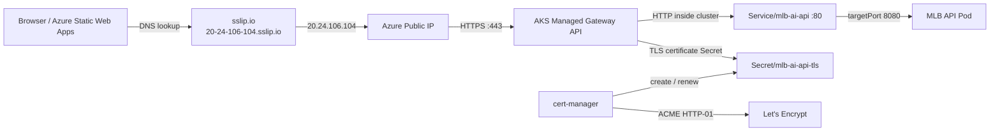

# AKS 免費 HTTPS 實作筆記

最後更新：2026-10-07

## 目標

將目前只有 HTTP 的 AKS API：

```text
http://20.24.106.104/health
```

改成瀏覽器信任的 HTTPS：

```text
https://20-24-106-104.sslip.io/health
```

這條路線不購買網域、不建立 Azure DNS Zone，也不使用付費憑證。

## 使用的免費元件

- `sslip.io`：依 hostname 中的 IP 自動提供 DNS A record。目前 `20-24-106-104.sslip.io` 解析到 `20.24.106.104`。
- Let’s Encrypt：免費簽發公開信任的 TLS 憑證。
- cert-manager：安裝在 AKS，負責申請、儲存與自動續期憑證。
- Kubernetes Gateway API：接收 HTTPS，在 Gateway 終止 TLS，再將流量轉給 API Service。

這三項不另外收費，但既有 AKS Node、Azure Load Balancer、managed disk 與 Public IP 仍依 Azure 定價計費。

## 架構



`TLS termination` 是指 HTTPS 加密連線在 Gateway 解密。Gateway 到同一 AKS cluster 內的 Service 使用 HTTP；對外使用者仍得到受信任的 HTTPS。

## Repository 設定

```text
k8s/overlays/gateway-tls/
  kustomization.yaml
  letsencrypt-cluster-issuer.yaml
  backend-certificate.yaml
  gateway-tls-patch.yaml
  http-route-tls-patch.yaml
```

- `ClusterIssuer/letsencrypt-prod` 定義 Let’s Encrypt ACME server、帳號 email 與 HTTP-01 解題方式。
- `Certificate/mlb-ai-api-tls` 要求 cert-manager 取得 hostname 憑證，結果存進 `Secret/mlb-ai-api-tls`。
- Gateway 新增 port `443` listener，並引用該 TLS Secret。
- HTTPRoute 同時連到 HTTP 與 HTTPS listener，且只接受指定 hostname。

## Pipeline 流程

執行 `azure-pipelines-aks-lab.yml` 時選擇：

```text
operation:      Deploy
includeGateway: true
includeTls:     true
```

Pipeline 依序執行：

1. 用 `HelmInstaller` 準備 Helm。
2. 安裝或升級 cert-manager，並開啟 Gateway API 支援。
3. 套用 namespace、Application Insights Secret 與 `gateway-tls` overlay。
4. 將 Deployment image 更新成不可變的 `aks-lab-<BuildId>` tag。
5. 等待 API rollout 與 cluster 內部 smoke test 成功。
6. 等待 Certificate `Ready=True`。
7. 等待 Gateway `Programmed=True`。
8. 確認 sslip.io 解析到 Gateway Public IP。
9. 從 Pipeline Agent 呼叫 HTTPS `/health`，必須取得 HTTP 200 且憑證驗證成功。

## 驗證指令

```bash
kubectl get pods -n cert-manager
kubectl get clusterissuer letsencrypt-prod
kubectl get certificate,certificaterequest,order,challenge -n mlb-ai-go
kubectl describe certificate mlb-ai-api-tls -n mlb-ai-go
kubectl get gateway,httproute -n mlb-ai-go
curl -i https://20-24-106-104.sslip.io/health
```

成功狀態應包含：

```text
Certificate Ready=True
Gateway Programmed=True
HTTPRoute Accepted=True
HTTPRoute ResolvedRefs=True
HTTPS /health = HTTP 200
```

## 限制

- `sslip.io` 適合 Lab，不適合作為正式產品品牌網域。
- hostname 寫入目前 Public IP；若 Gateway 或 cluster 重建後 IP 改變，必須更新 YAML 與變數。
- HTTP port 80 暫時保留給 Let’s Encrypt HTTP-01 challenge。之後可以另加 HTTP-to-HTTPS redirect，但不能阻斷 challenge。
- Frontend production API base URL 已切換到這個 AKS HTTPS hostname；若 AKS Stop 或 Destroy，公開網站的資料載入也會停止。

## Deployment Result

2026-10-07 Azure DevOps AKS Pipeline run `#31` 成功完成：

```text
ClusterIssuer/letsencrypt-prod: Ready=True
Certificate/mlb-ai-api-tls:    Ready=True
CertificateRequest:            Approved=True / Ready=True
ACME Order:                    valid
Gateway:                       Programmed=True
HTTPS /health:                 HTTP 200
```

外部健康檢查回傳 `version=aks-lab-30`、`buildId=31`、`imageTag=aks-lab-30`，證明 HTTPS request 經 Gateway、Service 到達 AKS Pod。
