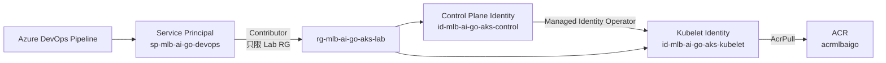

# AKS Lab Runbook

這份操作手冊描述低成本、純 Azure 的 AKS 練習流程。本機不需要 Docker Desktop；Docker image 由 ACR Tasks 在 Azure 建置，AKS 操作由 Azure DevOps hosted agent 執行。

## Current Progress

最後更新：2026-10-07

目前已完成 AKS 建立前準備、雲端驗證與第一次成功建立：

- 建立手動操作的 Azure DevOps Pipeline `MLB_AI_GO-AKS-Lab`。
- 完成 `Plan`，確認預計使用的 AKS、節點、網路與共用資源設定。
- 建立 Lab Resource Group 與兩個 User Assigned Managed Identities。
- 完成 Azure Resource Provider、ACR、VM SKU、vCPU quota、RBAC 與 Kubernetes manifests 檢查。
- Azure DevOps 雲端 `Preflight` 已成功。
- 2026-10-06 的第一次 `Create` run `#24` 因 `Standard_B2s` 不被此訂閱的 East Asia AKS 接受而失敗。
- 修正為 `Standard_D2_v4` 並加入實際 quota gate，commit `9871956` 已同步到 GitHub 與 Azure DevOps。
- 修正後的雲端 Preflight run `#26` 成功。
- AKS Create run `#27` 成功。
- AKS Deploy run `#28` 完成第一次內部部署；Gateway Deploy run `#30` 已完成公開入口與 immutable image 驗證。
- 手動刪除 MLB API Pod 後，ReplicaSet 成功建立替代 Pod，self-healing 已驗證。
- Scale、Rolling Update、Rollback 與 Readiness failure 實驗已完成。
- Managed Gateway API 與 Application Routing Istio 已啟用。
- Node pool 因 `istiod` CPU Requests 從 1 擴成 2，兩個 `istiod` 均已 Running。
- `Gateway/mlb-ai-api-gateway` 與 `HTTPRoute/mlb-ai-api` 已部署，公開 `/health` 回傳 HTTP 200。

目前 AKS 有兩個 node VM、managed disks、Gateway Load Balancer 與 Public IP，都可能產生費用。MLB API 已透過 `http://20.24.106.104` 對外公開。

目前主要結構為：

```text
rg-mlb-ai-go-aks-lab
  id-mlb-ai-go-aks-control
  id-mlb-ai-go-aks-kubelet
  aks-mlb-ai-go-lab

MC_rg-mlb-ai-go-aks-lab_aks-mlb-ai-go-lab_eastasia
  aks-nodepool1-10369250-vmss
  VNet / NSG / managed network resources
```

Cluster 狀態為 `Succeeded / Running`，system node pool 是 `2 x Standard_D2_v4`、每台 32 GiB OS disk；兩個 Kubernetes node 都是 `Ready`。

目前應用程式狀態：

```text
Namespace:  mlb-ai-go
Deployment: mlb-ai-api 1/1 available
Pod:        mlb-ai-api-59dbdd9457-pvcgw 1/1 Running
Image:      acrmlbaigo.azurecr.io/mlb-ai-api:aks-lab-30
Service:    ClusterIP 10.0.105.212:80
Endpoint:   10.244.1.28:8080 (Pod IP may change)
```

詳細 Kubernetes runtime 架構與 self-healing 筆記請看 [Kubernetes Runtime Lab Notes](./kubernetes-runtime-lab.md)。

## What Was Implemented

### 1. Separate Manual Pipeline

新增的 Pipeline YAML 是：

```text
azure-pipelines-aks-lab.yml
```

它設定 `trigger: none` 與 `pr: none`，因此 push 或 pull request 不會自動建立、停止或刪除 AKS。所有操作都必須由使用者在 Azure DevOps 手動選擇。

Pipeline 目前提供八種 operation：

| Operation | 用途 | 是否可能產生主要費用 |
| --- | --- | --- |
| `Plan` | 顯示預計使用的設定，不連動資源變更 | 否 |
| `Preflight` | 檢查 Azure、權限、配額與 manifests | 否 |
| `Create` | 建立 AKS cluster、兩台 node 與 Managed Gateway API | 是 |
| `Deploy` | 建置 image 並部署到既有 AKS | 視既有資源與 ACR build 而定 |
| `Stop` | 停止 AKS control plane 與 node compute | 降低費用，但部分資源仍可能計費 |
| `Start` | 啟動已停止的 AKS | 是 |
| `Status` | 查詢 cluster 狀態 | 否 |
| `Destroy` | 刪除 AKS 與受控 node resources | 刪除後停止主要 AKS 費用 |

Pipeline 使用 Microsoft-hosted `ubuntu-latest` agent，並透過 Azure Resource Manager service connection `sc-mlb-ai-go-azure` 登入 Azure。這裡要注意：Pipeline 使用的是 Service Principal，不是瀏覽器中登入的個人帳號。

### 2. Centralized Configuration

AKS Lab 的固定參數放在 `infra/aks-lab/variables.ps1`：

| 設定 | 值 |
| --- | --- |
| Region | `eastasia` |
| Lab Resource Group | `rg-mlb-ai-go-aks-lab` |
| Cluster | `aks-mlb-ai-go-lab` |
| Node VM | `Standard_D2_v4` |
| Node count | `2` |
| OS disk | `32 GiB` |
| Shared Resource Group | `rg-mlb-ai-go-dev` |
| Shared ACR | `acrmlbaigo` |
| Kubernetes namespace | `mlb-ai-go` |

集中設定的目的，是避免 Pipeline YAML、PowerShell 與操作文件各自寫一套名稱，降低日後改名或切換區域時漏改的機率。

### 3. Bootstrap Resources

一次性的管理者腳本是 `infra/aks-lab/bootstrap-aks-lab.ps1`，它負責：

1. 註冊 AKS 會用到的 Azure Resource Providers。
2. 建立 `rg-mlb-ai-go-aks-lab`。
3. 建立 control plane 與 kubelet identities。
4. 建立最小範圍的 RBAC assignments。
5. 明確不建立 AKS 或 node compute。

這些 bootstrap resources 可以在每天刪除 AKS 後繼續保留，下一次不必重建身分與權限。

### 4. Managed Identities And RBAC

目前的身分與權限關係如下：



| Principal | Role | Scope | 用途 |
| --- | --- | --- | --- |
| Azure DevOps Service Principal | `Contributor` | `rg-mlb-ai-go-aks-lab` | 讓 Pipeline 在 Lab RG 建立與管理 AKS |
| Control plane identity | `Managed Identity Operator` | kubelet identity | 允許 AKS 把指定的 kubelet identity 指派給節點 |
| Kubelet identity | `AcrPull` | `acrmlbaigo` | 允許節點從 ACR 拉取 backend image |

沒有把 Azure DevOps Service Principal 設成整個訂閱的 `Owner` 或 `Contributor`。這是最小權限原則：只授予完成工作所需要的範圍。

### 5. Plan

`Plan` 只讀取設定並印出預計使用的 Lab RG、cluster、region、AKS tier、node、disk、ACR、identities 與 Ingress 選項。它也會明確提示既有的 `rg-mlb-ai-go-dev` 不會被刪除。

本機可以執行：

```powershell
.\infra\aks-lab\manage-aks-lab.ps1 -Operation Plan
```

這一步不會修改 Azure，適合每次改完 IaC 或參數後先做人工審閱。

### 6. Preflight

`Preflight` 是正式建立 AKS 前的檢查關卡，會確認：

1. Service connection 實際連到正確的 Azure subscription。
2. `Microsoft.Compute`、`Microsoft.ContainerService`、`Microsoft.Network` 都已註冊。
3. 共用 ACR `acrmlbaigo` 存在且可讀取。
4. `Standard_D2_v4` 能在 East Asia 使用。
5. Regional vCPU 與 Dv4-family quota 有足夠額度。
6. Lab RG 與 shared dev RG 不會使用相同名稱。
7. Lab RG 與兩個 identities 都存在且可讀取。
8. `k8s/base` 可以用 `kubectl kustomize` 成功渲染。
9. `k8s/overlays/gateway` 也可以成功渲染。

本次檢查到的主要 quota：

```text
Total Regional vCPUs     0 / 10
Standard Dv4 Family vCPUs  0 / 10
```

一台 `Standard_D2_v4` 需要 2 vCPU，因此目前額度足夠。Preflight 會同時檢查 regional 與 Dv4-family 剩餘額度是否至少有 2 vCPU。它只做讀取與 manifest 渲染，不會呼叫 `az aks create`。

## Problems And Troubleshooting

### Problem 1: Service Connection Could Not Read The Lab Resource Group

雲端 Preflight 一開始失敗，關鍵錯誤是：

```text
AuthorizationFailed
Microsoft.Resources/subscriptions/resourcegroups/read
```

當時個人 Azure 帳號可以在 Portal 看見 Lab RG，但 Azure DevOps Pipeline 無法執行 `az group show`。原因是 Service Principal 原本只有 `rg-mlb-ai-go-dev` 的 `Contributor`，新的 `rg-mlb-ai-go-aks-lab` 沒有對它授權。

這說明「使用者能看到」不等於「Pipeline 能看到」。兩者使用不同的 Azure identity 與 RBAC assignments。

修正方式是將 Azure DevOps Service Principal 加到 Lab RG：

```text
sp-mlb-ai-go-devops
  Contributor
  scope = rg-mlb-ai-go-aks-lab
```

修正後重新執行 Preflight，最終 run `#23` 成功。

如果日後再次出現同類錯誤，可依序檢查：

1. Pipeline 使用哪一個 service connection。
2. Service connection 對應哪一個 Service Principal object ID。
3. 該 object ID 在目標 Resource Group 是否真的有 role assignment。
4. 新增 RBAC 後是否已等待 Azure 權限傳播，再重跑 Pipeline。

### Problem 2: AKS Node Resource Group Cannot Be Pre-created

最初曾考慮預先建立 node Resource Group，目的是先把所有權限準備好。但 AKS 的 managed node Resource Group 不能用一個已存在的 Resource Group 充當。

正確生命週期是：

```text
az aks create
  -> AKS 自動建立 MC_* node Resource Group
  -> VMSS、disk、network、Load Balancer 等資源放在其中

az aks delete
  -> AKS cluster 被刪除
  -> AKS 自動清除 managed node Resource Group
```

因此最後改成：

- 預先建立並保留 `rg-mlb-ai-go-aks-lab`。
- 不預先建立 `MC_*` node Resource Group。
- 讓 AKS Resource Provider 建立與管理 node RG。
- 刪除先前測試用的空白 node RG，避免建立 AKS 時衝突。

這也建立了一個重要觀念：Resource Group 不只是分類資料夾，它可能同時代表某個服務的管理與生命週期邊界。

### Problem 3: Local Success Does Not Prove Pipeline Permission

本機 `Preflight` 可以成功，是因為本機 Azure CLI 使用個人帳號。Azure DevOps 雲端 Preflight 使用 Service Principal，所以仍可能因 RBAC 不同而失敗。

因此保留兩層驗證：

```text
Local validation
  -> 驗證腳本、Azure 設定與 manifests

Azure DevOps Preflight
  -> 驗證真正部署身分、hosted agent 與 service connection
```

兩邊都成功後，才算完成 AKS 建立前的準備。

### Problem 4: The Original B2s SKU Was Rejected By AKS

第一次正式執行 `Create` 時，Azure 在建立任何 AKS 資源前拒絕了 `Standard_B2s`：

```text
The VM size of Standard_B2s is not allowed in your subscription in location 'eastasia'.
```

原本的 Preflight 使用 `az vm list-sizes`，只能證明一般 Azure VM catalog 中列得到這個 SKU，不能保證 AKS 對這個 subscription 與 region 組合也接受它。這是檢查範圍不足，不是 RBAC、identity 或 Pipeline 登入失敗。

Azure 回傳的 AKS allowed list 包含 `Standard_D2_v4`，而此訂閱在 East Asia 的 Dv4-family quota 是 `0/10`。因此修正為：

```text
NodeVmSize        = Standard_D2_v4
NodeVmQuotaFamily = standardDv4Family
```

沒有改用同樣出現在 allowed list 的 `Standard_B2s_v2`，因為此訂閱當時的 Bsv2-family quota 是 `0/0`，重跑仍可能因 quota 失敗。`Standard_D2_v4` 有 2 vCPU、8 GiB RAM，也符合 AKS system node pool 的基本需求。

Preflight 同時補上真正的 quota gate：它現在會計算 `node count x 每台 vCPU`，並確認 regional quota 與 VM-family quota 都有足夠剩餘額度；不足時會在 `Create` 前直接失敗並顯示缺少多少 vCPU。

本次失敗後確認：

- `az aks list` 仍是空陣列。
- Lab RG 仍只有兩個 managed identities。
- 沒有留下 VM、disk、Load Balancer 或 `MC_*` node Resource Group。

## Pre-Create Verification (2026-10-02)

本次完成時確認：

- Azure DevOps `Plan` 成功。
- Azure DevOps `Preflight` run `#23` 成功。
- 本機 PowerShell 腳本語法檢查成功。
- Base 與 ingress Kustomize overlays 都能渲染。
- 驗證當下，GitHub、Azure DevOps 與本機的 AKS 自動化程式都指向 commit `71dcf1b`。
- `az aks list --resource-group rg-mlb-ai-go-aks-lab` 回傳空陣列。
- Lab RG 中只有 control 與 kubelet identities。
- 沒有執行 Pipeline 的 `Create`。

因此當下沒有 AKS node VM、disk、application ingress 或其他 AKS workload 正在運行。

## Create Verification (2026-10-06)

修正 SKU 後確認：

- GitHub、Azure DevOps 與 Pipeline 都使用 commit `9871956`。
- 雲端 Preflight run `#26` 成功。
- Create run `#27` 成功。
- Cluster `aks-mlb-ai-go-lab` 為 `Succeeded / Running`。
- Kubernetes 版本為 `1.35`。
- Node pool `nodepool1` 為 system mode、`1 x Standard_D2_v4`、32 GiB OS disk。
- Node `aks-nodepool1-10369250-vmss000000` 為 `Ready`。
- AKS 自動建立 `MC_rg-mlb-ai-go-aks-lab_aks-mlb-ai-go-lab_eastasia`。
- 驗證當下尚未執行 `Deploy`；後續 Deploy run `#28` 已成功。

## Deploy And Self-Healing Verification (2026-10-06)

- Deploy run `#28` 成功。
- ACR image `mlb-ai-api:aks-lab-28` 拉取成功，證明 kubelet identity 的 `AcrPull` 正常。
- Deployment `mlb-ai-api` 為 `1/1` available。
- Pod 為 `1/1 Running`、`RESTARTS=0`。
- ClusterIP Service `10.0.105.212:80` 指向 Pod endpoint `10.244.0.112:8080`。
- ConfigMap 與 Application Insights Secret 已建立。
- Pipeline 內部 `/health` smoke test 成功。
- 手動刪除舊 Pod `mlb-ai-api-869dfc6cd5-77k9j` 後，ReplicaSet 自動建立 `mlb-ai-api-869dfc6cd5-s5rw4`。
- 新 Pod 使用相同 ReplicaSet 與 image，最後回到 `1/1 Running`，self-healing 成功。
- Service IP 保持不變並改指向新 Pod IP。
- Gateway API 已啟用，公開 `/health` endpoint 已從 cluster 外部驗證成功。

## Review Checklist

日後複習時，可以用以下問題確認是否理解這一階段：

1. 為什麼 Pipeline 看不到資源，但個人帳號看得到？
2. Service Principal、Service Connection 與 RBAC 各自扮演什麼角色？
3. 為什麼 kubelet identity 需要 `AcrPull`？
4. 為什麼 control plane identity 要能操作 kubelet identity？
5. 為什麼 node Resource Group 不應預先建立？
6. `Plan` 和 `Preflight` 的差異是什麼？
7. 為什麼 Push 程式碼不會自動建立 AKS？
8. 哪一個操作才會開始產生主要 AKS compute 費用？
9. `Stop` 和 `Destroy` 在成本與資源保留上有什麼差別？
10. 為什麼本機驗證成功後，仍需在 Azure DevOps 再跑一次 Preflight？

## Resource Boundary

現有環境與練習環境刻意分開：

```text
rg-mlb-ai-go-dev                  長期保留
  ACR                             共用 image registry
  Application Insights           共用 API telemetry
  Static Web App                  現有 frontend
  Container App                   現有 backend

rg-mlb-ai-go-aks-lab              免費 bootstrap 容器，保留
  User Assigned control identity  保留
  User Assigned kubelet identity  保留並持有 AcrPull
  AKS Free tier cluster           每日可拋棄

MC_rg-mlb-ai-go-aks-lab_*         AKS 自動建立，每日可拋棄
  VM scale set
  32 GiB managed OS disk
  Network resources
  Managed outbound networking     AKS 預設可包含 Standard Load Balancer / Public IP
  Public application endpoint     只有啟用 Ingress 時才建立
```

空的 Lab Resource Group、User Assigned Identities 與 RBAC assignments 本身不產生運算費用，因此會保留，讓權限可以限制在 Lab 範圍，不必把 Azure DevOps Service Principal 升成整個訂閱的 Owner。AKS node Resource Group 不能預先存在，必須由 AKS Resource Provider 自動建立。

`Destroy` 只允許刪除 AKS cluster 與 AKS 自動建立的 node Resource Group，不會刪除 bootstrap group、identities 或 `rg-mlb-ai-go-dev`。

## Pipeline

Pipeline YAML：

```text
azure-pipelines-aks-lab.yml
```

管理腳本與參數：

```text
infra/aks-lab/bootstrap-aks-lab.ps1
infra/aks-lab/manage-aks-lab.ps1
infra/aks-lab/variables.ps1
```

`bootstrap-aks-lab.ps1` 由有訂閱權限的管理者執行一次，建立一個空的 Lab Resource Group、兩個 identities 與最小範圍的 RBAC。日常 Pipeline 不需要訂閱層級 Owner 權限。

第一次使用時，在 Azure DevOps 建立一條新 pipeline，選擇 repository 內現有 YAML，路徑設為：

```text
/azure-pipelines-aks-lab.yml
```

Pipeline 沿用 Azure Resource Manager service connection：

```text
sc-mlb-ai-go-azure
```

## Operations

### Plan

只列出預定的資源與設定，不修改 Azure。每次調整 IaC 後先跑這個操作。

### Preflight

執行 Azure 與 repository 的唯讀檢查：

- 顯示 Azure DevOps service connection 實際登入的帳號與訂閱。
- 確認 `Microsoft.Compute`、`Microsoft.ContainerService` 與 `Microsoft.Network` providers 已註冊。
- 確認共用 ACR 存在。
- 確認 `Standard_D2_v4` 可在 East Asia 列出。
- 驗證 East Asia regional vCPU 與 Dv4-family quota 足以建立節點。
- 確認 bootstrap Resource Group 與兩個 identities 都存在。
- 確認 Lab 與共享 Resource Group 名稱不同。
- 使用 `kubectl kustomize` 渲染 base 與 ingress overlay。

Preflight 不建立或修改 AKS 資源。

### Create

建立：

- AKS Free tier cluster `aks-mlb-ai-go-lab`
- 兩台 `Standard_D2_v4` system nodes
- 每台 32 GiB managed OS disk
- Azure CNI Overlay 網路
- OIDC issuer 與 workload identity
- Managed Gateway API 與 Application Routing Istio
- 使用預先授權的 kubelet identity 從既有 ACR 拉 image

Create 不會部署應用程式或建立公開 Gateway，但會安裝 Gateway API 控制能力。

### Deploy

預設會：

1. 使用 ACR Tasks 在 Azure 建置 backend image。
2. 從 AKS 動態取得 admin kubeconfig；憑證只存在 hosted agent 的暫存環境。
3. 從現有 Application Insights 讀取 connection string。
4. 在 AKS 建立 Kubernetes Secret，不把 connection string 寫入 Git。
5. 套用 Namespace、ConfigMap、Deployment 和 ClusterIP Service。
6. 使用本次 pipeline build tag 更新 Deployment image。
7. 等待 rollout 完成。
8. 在 cluster 內建立一次性 curl Pod，呼叫 `/health` smoke test。

`includeGateway` 預設為 `false`。因此一般 Deploy 不會替 API 建立公開入口，但 AKS 本身仍可能保留受控的 Standard Load Balancer 與 Public IP，供 cluster outbound traffic 使用。

需要公開 API 時才把 `includeGateway` 設為 `true`。Pipeline 會額外：

- 套用 `k8s/overlays/gateway`。
- 建立 `Gateway` 與 `HTTPRoute`。
- 等待 Gateway `Programmed=True`。
- 取得 LoadBalancer Public IP。
- 從 Pipeline agent 執行公開 `/health` smoke test。

### Stop

執行 `az aks stop`，停止 control plane 和 node compute。適合當天中途暫停、稍後還要繼續時使用。

### Start

執行 `az aks start`，恢復前一次保存的 cluster state。啟動完成後才能再次 Deploy 或使用 `kubectl`。

### Status

顯示 cluster 是否存在，以及目前的 power state、provisioning state、Kubernetes version 和 node resource group。

### Destroy

刪除 AKS cluster 以及它管理的 VM、磁碟、Load Balancer、Public IP 等計費資源。必須同時把 `confirmDestroy` 設為 `true`，否則 pipeline 會拒絕執行。

Destroy 的順序：

1. 刪除 `aks-mlb-ai-go-lab` cluster。
2. AKS 清除並刪除它自動建立的 node Resource Group，包括 VM、磁碟和網路資源。
3. 保留空的 Lab bootstrap group、兩個 identities 和最小權限 RBAC。
4. 保留共用的 ACR、Application Insights、前端與 Container App。

## Recommended Daily Flow

```text
Plan
  -> Preflight
  -> Create
  -> Deploy (includeGateway=false)
  -> Kubernetes practice
  -> Stop / Start during long breaks
  -> Deploy (includeGateway=true) for the public Gateway lesson
  -> Destroy with confirmDestroy=true at the end of the day
```

每天 Destroy 後，下次 Create 通常需要重新等待 AKS provisioning。程式碼、image、telemetry、manifests、bootstrap identities 與權限都保留在 AKS 之外。

## Why The Frontend Is Not Switched Yet

目前 Static Web App 仍然呼叫既有 Container App。AKS Lab 是獨立驗證環境，刪除 AKS 不會讓目前網站中斷。

等 Ingress、DNS 與憑證流程穩定後，再新增一個 AKS 專用 frontend environment 或動態 API URL；不要先把目前 frontend 寫死到每天會改變的 Public IP。

## Local Plan Check

不登入 Azure也可以先確認參數：

```powershell
.\infra\aks-lab\manage-aks-lab.ps1 -Operation Plan
```

這個命令不建立任何 Azure 資源。
