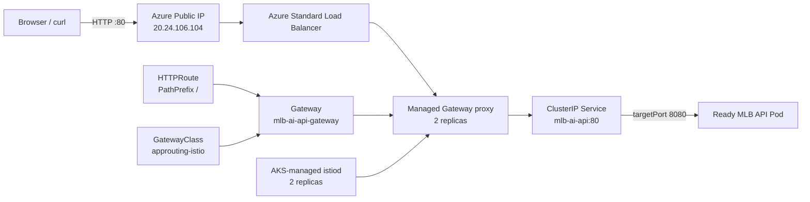

# AKS Gateway API Lab

最後更新：2026-10-07

這份筆記記錄 MLB AI API 從 AKS 內部 `ClusterIP` Service，進展到可從網際網路存取的 Azure Managed Gateway API 入口。

## Completed Result

- AKS Managed Gateway API installation 為 `Standard`。
- Application Routing Istio implementation 為 `Enabled`。
- `GatewayClass/approuting-istio` 為 `Accepted=True`。
- 兩個 `istiod` Pod 均為 `1/1 Running`，並分佈在兩個 Node。
- `Gateway/mlb-ai-api-gateway` 為 `Programmed=True`。
- `HTTPRoute/mlb-ai-api` 為 `Accepted=True` 且 `ResolvedRefs=True`。
- Azure Load Balancer 已分配 Public IP `20.24.106.104`。
- 從 cluster 外部請求 `http://20.24.106.104/health` 回傳 HTTP 200。

目前公開 API 僅使用 HTTP，尚未設定 DNS 與 TLS，因此只適合 Lab 學習。

## Why Gateway API

傳統 Kubernetes Ingress 將 controller 與 route 設定大多集中在 Ingress resource 與 controller-specific annotations。Gateway API 將職責拆開：

- `GatewayClass`：定義哪個平台或 controller 實作 Gateway。
- `Gateway`：定義對外 listener，例如 HTTP port 80。
- `HTTPRoute`：定義 hostname/path 規則與後端 Service。
- `Service`：在 cluster 內將流量導向 Ready Pod。

本專案使用 AKS 管理的 `approuting-istio` GatewayClass，而不自行安裝 NGINX Helm chart。

## Architecture



Application Routing 這裡使用 Istio 控制 Gateway，但沒有啟用完整 Service Mesh：

```text
serviceMeshProfile.mode = Disabled
```

因此 MLB API Pod 沒有被注入 Istio sidecar。

## Enablement

在既有 AKS 啟用兩個管理功能：

```bash
az aks update \
  --resource-group rg-mlb-ai-go-aks-lab \
  --name aks-mlb-ai-go-lab \
  --enable-gateway-api \
  --enable-app-routing-istio
```

啟用後 Azure 建立 Gateway API CRD、`GatewayClass`、webhooks、ConfigMaps 與 `aks-istio-system` 內的 `istiod`。

## Capacity Problem And Resolution

初次啟用時，只有一個 `Standard_D2_v4` Node。第二個 `istiod` 一直 `Pending`，Event 顯示：

```text
0/1 nodes are available: 1 Insufficient cpu
```

每個 `istiod` 的 Requests 為：

```text
cpu:    500m
memory: 2Gi
```

Kubernetes Scheduler 使用 Requests 做排程，不是只看 `kubectl top` 的當下使用量。因此即使節點當下 CPU 只有約 9%，剩餘的可承諾 CPU Requests 仍可能不足。

解法是將 system node pool 擴充為兩個 Node：

```bash
az aks scale \
  --resource-group rg-mlb-ai-go-aks-lab \
  --name aks-mlb-ai-go-lab \
  --nodepool-name nodepool1 \
  --node-count 2
```

完成後兩個 Node 皆為 `Ready`，兩個 `istiod` 也均為 `Running`。這也讓現有 Lab 在運行時的 node compute 成本大致變成原本兩倍。

## Repository Manifests

```text
k8s/overlays/gateway/
  kustomization.yaml
  backend-gateway.yaml
  backend-http-route.yaml
```

`backend-gateway.yaml` 使用 `approuting-istio` 並開啟 HTTP port 80。`backend-http-route.yaml` 將所有 `/` PathPrefix 流量導向 `Service/mlb-ai-api` port 80。

目前沒有限制 hostname，是為了能用 Public IP 直接測試。後續加入 DNS/TLS 後，再收緊 hostname 與 HTTPS listener。

## Resources Created From The Gateway

套用 Gateway 後，AKS 自動建立：

```text
Deployment  mlb-ai-api-gateway-approuting-istio   2/2
Service     mlb-ai-api-gateway-approuting-istio   LoadBalancer
HPA         mlb-ai-api-gateway-approuting-istio   min 2 / max 5
PDB         mlb-ai-api-gateway-approuting-istio   min available 1
Public IP   20.24.106.104
```

- Gateway proxy Deployment 真正處理入站 HTTP request。
- LoadBalancer Service 讓 Azure 建立公開網路入口。
- HPA 可依 CPU 使用量調整 Gateway proxy 數量。
- PDB 保證維護或排程中斷時，至少保留一個可用 Gateway proxy。

## Verification

Kubernetes 路由狀態：

```text
Gateway:   Programmed=True
HTTPRoute: Accepted=True
HTTPRoute: ResolvedRefs=True
```

外部 smoke test：

```bash
curl http://20.24.106.104/health
```

結果為 HTTP 200，回傳 `status: healthy`，並確認 API process、MLB Stats API client 設定、CORS 與 Application Insights 都已設定。

## Pipeline Changes

`azure-pipelines-aks-lab.yml` 將舊的 `includeIngress` 改為 `includeGateway`，不再安裝 NGINX Helm chart。

`infra/aks-lab/manage-aks-lab.ps1` 現在會：

1. Create 時啟用 Managed Gateway API 與 Application Routing Istio。
2. 重建 Lab 時預設建立兩個 Node。
3. Deploy 且 `includeGateway=true` 時套用 Gateway overlay。
4. 等待 Gateway `Programmed=True`。
5. 取得 Public IP 並從 Pipeline agent 執行 `/health` smoke test。

## Current Boundary

這一階段已完成「AKS backend 對外公開並可驗證」。尚未完成：

- DNS 與 HTTPS/TLS。
- Azure Static Web Apps 前端改用 AKS API。
- Gateway access logs 集中到 Azure Monitor。
- API workload 自己的 HPA。
- NetworkPolicy 與生產等級的存取限制。

當天停止練習時，應執行 AKS `Stop`或 `Destroy`，因為目前兩個 Node、managed disks、Load Balancer 與 Public IP 都可能產生費用。
