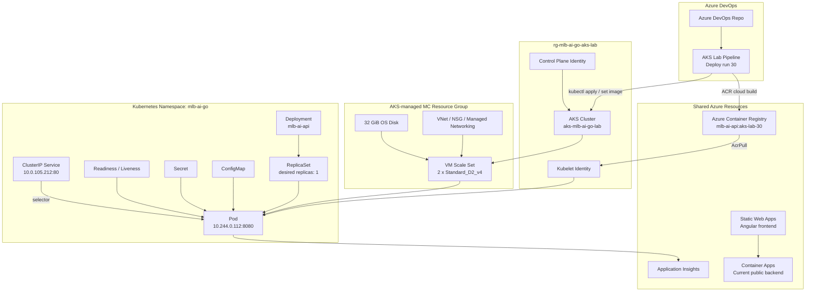
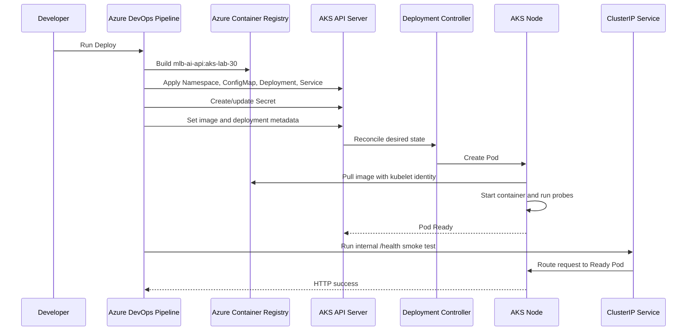
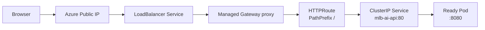

# Kubernetes Runtime Lab Notes

最後更新：2026-10-07

這份筆記整理 MLB AI GO 實際部署到 AKS 後的架構、Kubernetes 核心觀念、部署流程與第一次 self-healing 實驗。

## Current Runtime State

目前已完成：

- AKS cluster `aks-mlb-ai-go-lab` 建立成功。
- Kubernetes 版本為 `1.35.8`。
- System node pool 為 `2 x Standard_D2_v4`，OS disk 各 32 GiB。
- Azure DevOps AKS Lab Pipeline run `#30` 完整 Gateway Deploy 成功。
- Backend image 為 `acrmlbaigo.azurecr.io/mlb-ai-api:aks-lab-30`。
- Namespace、Deployment、ReplicaSet、Pod、Service、ConfigMap 與 Secret 都已建立。
- Readiness probe、liveness probe 與 cluster 內部 smoke test 已通過。
- 手動刪除 Pod 後，ReplicaSet 已自動建立替代 Pod，self-healing 驗證成功。
- Scale、Rolling Update、Rollback 與 Readiness failure 實驗已完成。
- Managed Gateway API 已啟用，`http://20.24.106.104/health` 可從 cluster 外部存取。

目前實際資源：

```text
Cluster: aks-mlb-ai-go-lab
Nodes:   aks-nodepool1-10369250-vmss000000, vmss000001

Namespace: mlb-ai-go
  Deployment: mlb-ai-api                  1/1 available
  ReplicaSet: mlb-ai-api-869dfc6cd5       1 desired / 1 ready
  Pod:        mlb-ai-api                   1/1 Running
  Service:    mlb-ai-api                  ClusterIP 10.0.105.212:80
  Endpoint:   10.244.0.112:8080
  ConfigMap:  mlb-ai-api-config
  Secret:     mlb-ai-api-secrets
  Gateway:    mlb-ai-api-gateway           Programmed=True
  HTTPRoute:  mlb-ai-api                   Accepted=True
  Public IP:  20.24.106.104
```

## Four Architecture Layers

理解這套環境時，可以把它分成四層。

### 1. Azure Infrastructure Layer

Azure 負責提供底層資源：

- AKS managed cluster。
- VM Scale Set node。
- VNet、NSG 與 Azure CNI Overlay。
- Managed OS disk。
- Azure Container Registry。
- User Assigned Managed Identities 與 Azure RBAC。

這一層主要透過 Azure Portal、Azure CLI 與 Azure DevOps Pipeline 管理。

### 2. Kubernetes Cluster Layer

Kubernetes 負責管理應用程式執行狀態：

- Namespace 隔離資源。
- Deployment 宣告應用程式應該如何運行。
- ReplicaSet 維持指定的 Pod 數量。
- Scheduler 決定 Pod 放到哪個 Node。
- Service 提供穩定的內部網路入口。
- Probes 持續判斷 Container 是否健康。

這一層主要透過 `kubectl` 與 Kubernetes manifests 管理。

### 3. Application Layer

目前應用程式層只有 backend：

- .NET API Container。
- Port `8080`。
- `/health` 健康檢查。
- 從 ConfigMap 取得非敏感設定。
- 從 Secret 取得 Application Insights connection string。
- 對外呼叫 MLB Stats API。

### 4. Delivery And Operations Layer

Azure DevOps Pipeline 負責：

1. 使用 ACR Tasks 在 Azure 建置 image。
2. 產生唯一 image tag，例如 `aks-lab-28`。
3. 取得 AKS 暫時 kubeconfig。
4. 建立或更新 Secret。
5. 套用 Kustomize manifests。
6. 更新 Deployment image 與版本環境變數。
7. 等待 rollout 完成。
8. 從 cluster 內部執行 `/health` smoke test。

## Current Architecture Diagram



圖中最後一條很重要：目前正式 frontend 仍呼叫 Container Apps backend，尚未切換到 AKS。AKS 是獨立的練習環境。

## Kubernetes Resource Ownership

資源關係可以記成：

```text
Cluster
└─ Node Pool
   └─ Node

Namespace: mlb-ai-go
├─ Deployment
│  └─ ReplicaSet
│     └─ Pod
│        └─ Container
├─ Service
├─ ConfigMap
└─ Secret
```

### Cluster

Cluster 是整個 Kubernetes 環境。AKS 幫忙管理 control plane，本專案支付並管理 worker node 相關資源。

### Node Pool And Node

Node pool 是一組規格相近的運算節點。目前只有：

```text
nodepool1
  mode: System
  count: 1
  VM: Standard_D2_v4
```

Node 是真正執行 Pod 的 VM。目前所有 system pods 與 MLB API Pod 都放在同一台 Node。

### Namespace

Namespace 是 Kubernetes 內的邏輯隔離範圍。本專案使用：

```text
mlb-ai-go
```

查詢時加上 `-n mlb-ai-go`，可以只看本專案資源。`kube-system` 則放 AKS DNS、network、storage driver 等系統元件。

### Deployment

Deployment 描述應用程式的期望狀態：

- 使用哪個 image。
- 需要幾個 replicas。
- Container port。
- 環境變數來源。
- CPU 與 memory requests/limits。
- Readiness 與 liveness probes。

Deployment 不直接維護 Pod，而是建立並管理 ReplicaSet。

### ReplicaSet

ReplicaSet 的核心責任是維持 Pod 數量：

```text
desired replicas = 1
actual ready pods = 1
```

如果 actual 變成 0，ReplicaSet 就會建立新 Pod。Deployment 每次修改 Pod template，也會建立新的 ReplicaSet，舊 ReplicaSet 通常保留為 0，供 rollout history 與 rollback 使用。

### Pod

Pod 是 Kubernetes 排程與執行 Container 的基本單位。目前 Pod 包含一個 `mlb-ai-api` Container。

Pod 是可替換資源：

- 名稱會改變。
- Pod IP 會改變。
- Node 故障或人為刪除時可以被重建。
- 不應讓前端直接依賴 Pod 名稱或 Pod IP。

### Service

Service 提供穩定的虛擬 IP 與 DNS 名稱：

```text
mlb-ai-api.mlb-ai-go.svc.cluster.local
```

目前資料流：

```text
http://mlb-ai-api:80
  -> Service ClusterIP 10.0.105.212:80
  -> Endpoint 10.244.0.112:8080
  -> .NET API Container
```

Service 透過 label selector 找 Ready Pod，因此 Pod 被替換後，Service 位址不用改。

### ConfigMap

ConfigMap 放非敏感設定，目前包含：

- `ASPNETCORE_ENVIRONMENT`
- `Cors__AllowedOrigins__0`

ConfigMap 會進入 Pod 的環境變數，但修改 ConfigMap 不一定會自動重啟既有 Pod；通常要搭配 rollout 或重新部署。

### Secret

Secret 放敏感資料，目前由 Pipeline 動態建立，包含 Application Insights connection string。真實值不提交到 Git。

Kubernetes Secret 主要避免敏感值直接寫進 manifest；它不是完整的外部祕密管理系統。未來可以再練習 Azure Key Vault 與 Workload Identity。

## Health Checks

### Readiness Probe

Readiness probe 回答：

```text
這個 Pod 現在可以接收 Service 流量嗎？
```

如果失敗，Pod 可以保持 Running，但會暫時從 Service endpoints 移除。

### Liveness Probe

Liveness probe 回答：

```text
這個 Container 是否卡死，需要重新啟動？
```

連續失敗達門檻時，kubelet 會重啟 Container。

### Pipeline Smoke Test

Smoke test 是部署完成後的一次性驗證：

```text
curl Pod -> http://mlb-ai-api/health
```

三者差異：

| Check | 執行者 | 頻率 | 失敗結果 |
| --- | --- | --- | --- |
| Readiness | kubelet | 持續 | 暫停接流量 |
| Liveness | kubelet | 持續 | 重啟 Container |
| Smoke test | Pipeline | 每次 Deploy | Pipeline 失敗 |

## First Self-Healing Experiment

實驗中手動刪除：

```text
mlb-ai-api-869dfc6cd5-77k9j
```

ReplicaSet 自動建立：

```text
mlb-ai-api-869dfc6cd5-s5rw4
```

事件順序：

```text
Delete old Pod
  -> ReplicaSet detects actual replicas = 0
  -> SuccessfulCreate new Pod
  -> Scheduler assigns new Pod to Node
  -> Cached image is reused
  -> Container Created / Started
  -> Readiness succeeds
  -> Service endpoint points to new Pod IP
```

新 Pod 使用相同 ReplicaSet hash `869dfc6cd5`，表示這是相同版本的 replacement，不是新版本 rollout。

舊 Pod 終止時曾出現一次 readiness timeout。該 warning 指向正在關閉的舊 Pod，不是新 Pod；新 Pod 最後為 `1/1 Running`、`RESTARTS=0`，因此 self-healing 成功。

## Deployment Flow



## Current Gateway Network State

應用 Service 仍然是 `ClusterIP`，但已由 Managed Gateway 提供對外入口：

```text
Gateway Public IP: 20.24.106.104
```

因此流量路徑為：

```text
Internet -> Public IP -> Azure Load Balancer -> Gateway proxy
         -> HTTPRoute -> ClusterIP Service -> Ready Pod:8080
```

Static Web Apps 目前仍呼叫 Container Apps backend，尚未切換到 AKS。

## Gateway API Architecture



Gateway 定義 listener，HTTPRoute 定義路由，AKS 管理的 Gateway proxy 真正處理外部流量。完整啟用、排程問題與驗證過程請看 `docs/gateway-api-lab.md`。

## Useful Commands

### Overview

```bash
kubectl get nodes -o wide
kubectl get all -n mlb-ai-go
kubectl get events -n mlb-ai-go --sort-by=.lastTimestamp
```

### Inspect

```bash
kubectl describe deployment mlb-ai-api -n mlb-ai-go
kubectl describe pod -n mlb-ai-go <pod-name>
kubectl logs deployment/mlb-ai-api -n mlb-ai-go
```

### Network

```bash
kubectl get service -n mlb-ai-go
kubectl get endpointslice -n mlb-ai-go
kubectl port-forward service/mlb-ai-api 8080:80 -n mlb-ai-go
```

### Rollout

```bash
kubectl rollout status deployment/mlb-ai-api -n mlb-ai-go
kubectl rollout history deployment/mlb-ai-api -n mlb-ai-go
kubectl rollout undo deployment/mlb-ai-api -n mlb-ai-go
```

### Scale

```bash
kubectl scale deployment/mlb-ai-api --replicas=2 -n mlb-ai-go
kubectl get pods -n mlb-ai-go -w
kubectl scale deployment/mlb-ai-api --replicas=1 -n mlb-ai-go
```

手動 scale 只適合練習。下一次 Pipeline 再套用 manifests 時，Git 中宣告的 replica 數量可能把它改回去；這正是 declarative configuration 的概念。

## Current Cost And Cleanup Boundary

目前 AKS 正在 Running，因此 node VM、managed disk 與部分網路資源開始計費。應用 Pod 本身不會另外建立 VM，目前仍共用同一台 node。

短暫休息可用 `Stop`，當天練習結束且近期不再使用時，執行：

```text
operation: Destroy
confirmDestroy: true
```

Destroy 會刪除 cluster 與 AKS-managed `MC_*` Resource Group，但保留：

- Lab bootstrap Resource Group。
- Control plane 與 kubelet identities。
- 共用 ACR 與 images。
- Application Insights。
- 原本的 Static Web Apps 與 Container Apps 環境。
- Git 中的 manifests、Pipeline 與筆記。

## Review Questions

1. Deployment、ReplicaSet 和 Pod 分別負責什麼？
2. 為什麼 Pod 被刪除後會自動重建？
3. 為什麼 Service IP 不隨 Pod 改變？
4. `ClusterIP` 為什麼沒有 external IP？
5. Readiness、liveness 與 smoke test 有什麼差異？
6. 為什麼舊 ReplicaSet 會保留但 replicas 是 0？
7. ConfigMap 與 Secret 應該分別放什麼？
8. Kubelet identity 如何取得 ACR image？
9. Ingress 與 Ingress Controller 有什麼差異？
10. `Stop` 與 `Destroy` 對成本和資源生命週期有什麼差異？
