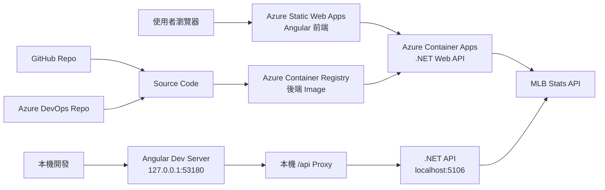
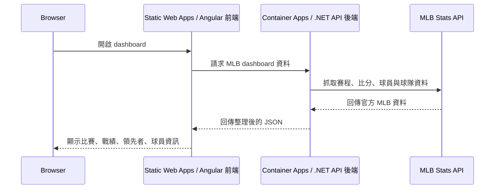
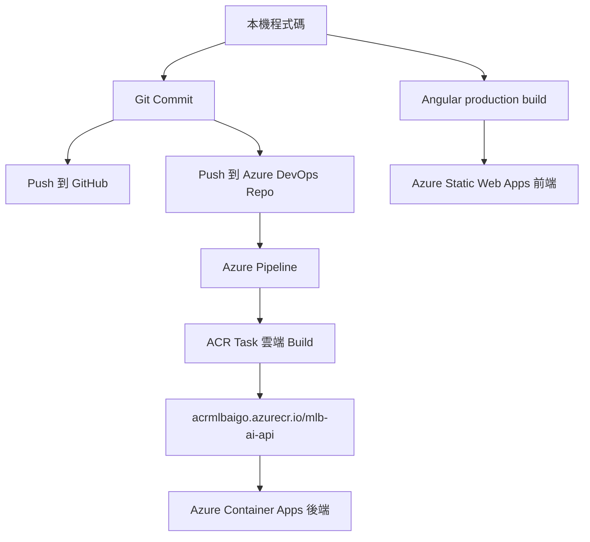

# MLB AI Daily 練習紀錄

最後更新：2026-09-13

## 目標

這是一個用來練習全端開發與 Azure 部署的 MLB dashboard side project。

這個專案不只是把功能做出來，也要把整個練習路線留下來，方便之後回頭複習：

- 建立前後端分離的專案
- 串接 MLB 即時比賽資料
- 一步一步加強前端 UI 和資料呈現
- 將原始碼同步到 GitHub 與 Azure DevOps
- 將前端與後端部署到 Azure
- 為後續 CI/CD 與 AKS 練習做準備

## 目前專案結構

```text
.
+-- backend/
|   +-- Dockerfile
|   +-- MlbAi.sln
|   +-- src/
|       +-- MlbAi.Api/
|       +-- MlbAi.Application/
|       +-- MlbAi.Infrastructure/
+-- frontend/
|   +-- angular.json
|   +-- package.json
|   +-- src/
+-- azure-pipelines.yml
+-- docs/
+-- PROJECT_CONTEXT.md
+-- README.md
```

## 架構圖



## 執行流程



## 部署流程



## 重要本機 Port

| Service | URL |
| --- | --- |
| Frontend dev server | `http://127.0.0.1:53180` |
| Backend API | `http://localhost:5106` |

前端刻意避開 `4200`，因為這個 port 常被其他 Angular 專案使用。

## Azure 開發資源

| Resource | 目前設定 |
| --- | --- |
| Frontend | Azure Static Web Apps Free |
| Backend | Azure Container Apps Consumption |
| Backend scale | `minReplicas=0`, `maxReplicas=1` |
| Backend size | `0.25 CPU`, `0.5Gi memory` |
| Container registry | Azure Container Registry Basic |
| Logs | Container Apps 自動建立的 Log Analytics workspace |

目前開發環境網址：

- Frontend: `https://yellow-forest-04081e300.5.azurestaticapps.net`
- Backend: `https://ca-mlb-ai-api.wonderfulpond-0bfd6efa.eastasia.azurecontainerapps.io`

## 為什麼目前不是 VM

目前這套部署沒有使用 Azure Virtual Machine。

前端是放在 Azure Static Web Apps。後端是包成 container，跑在 Azure Container Apps。Azure 會管理底層 compute、擴縮和 runtime 環境。因為後端設定是 `minReplicas=0`，所以沒有流量時可以縮到 0。

這跟 VM 不同。VM 是建立一台完整主機，通常只要機器存在或開著，就會持續產生成本。

## 目前成本預估

以目前學習用途來看，粗估月費：

- 輕量測試：約 US$5 到 US$8/月
- 每天偶爾使用：約 US$5 到 US$10/月
- 後端幾乎整天都有流量：約 US$20 到 US$30/月

主要固定成本是 Azure Container Registry Basic，大約 US$5/月。Static Web Apps 目前是 Free tier。Container Apps 大多是用量計費，而且目前後端可以 scale to zero。

## 後端筆記

後端是 .NET Web API，分成三個專案：

- `MlbAi.Api`：HTTP endpoints 與應用程式啟動設定
- `MlbAi.Application`：contracts 與 DTOs
- `MlbAi.Infrastructure`：MLB Stats API 串接

主要 API endpoints：

- `GET /`
- `GET /api/games/today`

後端會先把 MLB 官方 API 的資料整理成前端比較好用的 JSON。Dashboard 目前包含比賽卡片、分區戰績、外卡排名、球員大頭照、打者/投手數據、各項數據領先者。

## 前端筆記

前端是 Angular app。

本機開發：

```powershell
cd frontend
npm start
```

本機 dev server 會透過 `proxy.conf.json`，將 `/api` request 轉到 `http://localhost:5106`。

Production build 會使用這個檔案中的 Azure 後端 URL：

```text
frontend/src/environments/environment.production.ts
```

## Git 與 Remote 筆記

目前 remotes：

```text
origin -> GitHub
azure  -> Azure DevOps
```

目前工作規則：

- 不自動 push，除非明確要求
- 想先本機檢查時，只做 local commit
- 明確要求 push 時，才推到遠端

## 這次練習中的重要決策

- 前端和後端分成 `frontend/` 與 `backend/`。
- 前端使用 Angular。
- 後端使用 .NET Web API。
- 後端採用 Clean Architecture 風格拆成 Api、Application、Infrastructure。
- 避開本機前端 port `4200`，改用 `53180`。
- GitHub 作為主要原始碼 remote。
- 同步到 Azure DevOps，之後練 Azure Pipeline。
- 因為本機 Docker Desktop 被 WSL2/virtualization 問題卡住，所以先不依賴本機 Docker。
- 使用 Azure ACR cloud build，在 Azure 上 build Docker image。
- 前端部署到 Azure Static Web Apps。
- 後端部署到 Azure Container Apps，不先使用 VM 或 AKS。
- AKS 保留成後續進階練習。

## 目前下一步

1. 建立或完成 Azure DevOps service connection。
2. 將 `azure-pipelines.yml` 裡的 `TODO-AZURE-SERVICE-CONNECTION` 換成實際 service connection 名稱。
3. 從 Azure DevOps 執行 pipeline。
4. 每次練習完，到 Azure Cost Management 看一下成本。
5. 之後再加入 AKS 練習，例如 start/stop 或用 IaC 每次重建。

## 常用指令

Build 後端：

```powershell
dotnet build backend\MlbAi.sln
```

啟動後端：

```powershell
dotnet run --project backend\src\MlbAi.Api\MlbAi.Api.csproj
```

啟動前端：

```powershell
cd frontend
npm start
```

檢查 Git 狀態：

```powershell
git status --short
```

準備好後推到 GitHub：

```powershell
git push origin main
```

準備好後推到 Azure DevOps：

```powershell
git push azure main
```
