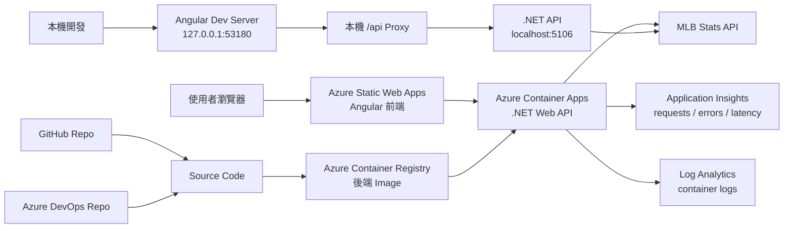
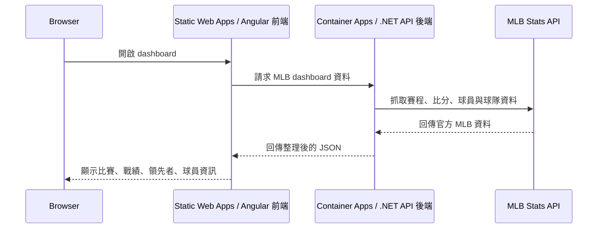
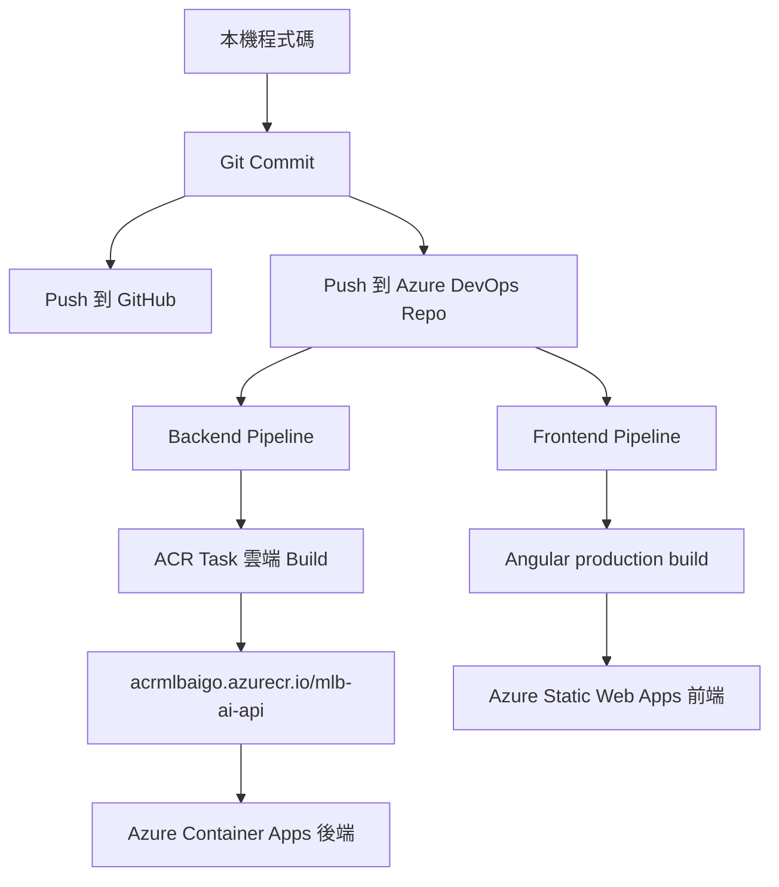
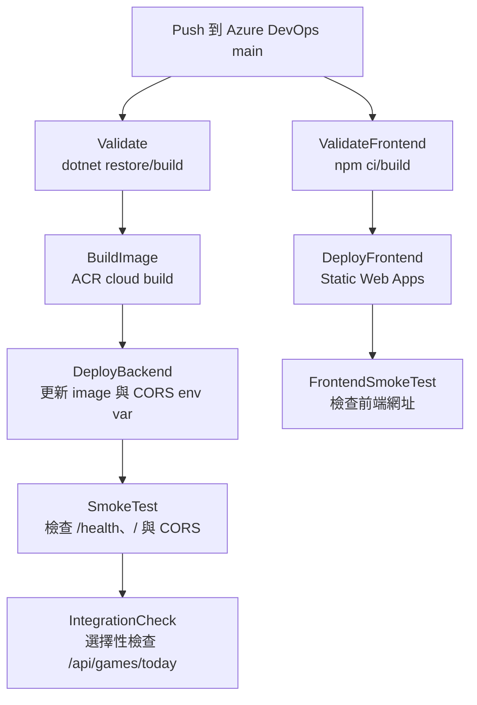

# MLB AI Daily 練習紀錄

最後更新：2026-09-21

## 目標

這是一個用來練習全端開發與 Azure 部署的 MLB dashboard side project。

這個專案不只是把功能做出來，也要把整個練習路線留下來，方便之後回頭複習：

- 建立前後端分離的專案
- 串接 MLB 即時比賽資料
- 一步一步加強前端 UI 和資料呈現
- 將原始碼同步到 GitHub 與 Azure DevOps
- 將前端與後端部署到 Azure
- 為後續 CI/CD 與 AKS 練習做準備

## 目前專案結構

```text
.
+-- backend/
|   +-- Dockerfile
|   +-- MlbAi.sln
|   +-- src/
|       +-- MlbAi.Api/
|       +-- MlbAi.Application/
|       +-- MlbAi.Infrastructure/
+-- frontend/
|   +-- angular.json
|   +-- package.json
|   +-- src/
+-- azure-pipelines.yml
+-- azure-pipelines-infra.yml
+-- azure-pipelines-backend.yml
+-- azure-pipelines-frontend.yml
+-- infra/
+-- docs/
+-- PROJECT_CONTEXT.md
+-- README.md
```

## 架構圖



## 執行流程



## 部署流程



## 目前 Azure DevOps Pipeline 流程



目前 Azure DevOps YAML 已拆開：

```text
azure-pipelines.yml           # 停用的總入口
azure-pipelines-infra.yml     # 手動觸發的 infra provisioning pipeline
azure-pipelines-backend.yml   # 後端 pipeline
azure-pipelines-frontend.yml  # 前端 pipeline
```

目前 pipeline 使用 Azure DevOps service connection 名稱：

```text
sc-mlb-ai-go-azure
```

這個 service connection 需要在 Azure DevOps 專案中建立，並授權它能操作目前的 Azure resource group 與 Container Apps。

## Backend Image Tag 策略

後端 image 現在不再只依賴單一 `latest` 概念，而是同一次 ACR build 會產生三種 tag：

```text
mlb-ai-api:<commit-sha>
mlb-ai-api:build-<azure-devops-build-id>
mlb-ai-api:dev-latest
```

其中實際部署到 Azure Container Apps 的是 `<commit-sha>`，這樣每個 Container Apps revision 都能追到明確程式版本。

部署時 backend pipeline 也會寫入：

```text
AppVersion
AppBuildId
AppImageTag
```

所以 `/health` 會多回傳 deployment metadata，方便確認目前 Azure 上跑的是哪次 commit / build。

## Observability 觀測

目前後端已開始接 Azure 觀測資源：

```text
Application Insights
Log Analytics Workspace
```

Application Insights 偏向看應用程式層級：

- request 次數
- response time
- failed requests
- dependency calls
- exception / failure

Log Analytics Workspace 偏向收集與查詢 logs：

- Container Apps console logs
- 平台 logs
- KQL 查詢

後端透過這個環境變數連到 Application Insights：

```text
APPLICATIONINSIGHTS_CONNECTION_STRING
```

這個值由 infra script 或 backend pipeline 從 Azure resource 查出來後注入 Container App，不會寫死在 repo。

`/health` 現在也會有：

```text
application-insights
```

用來確認目前 backend process 是否已經拿到 Application Insights connection string。

## Azure Infra Provisioning

目前已開始把 Azure dev 資源整理成可重跑的基礎設施腳本：

```text
infra/azure/
  README.md
  variables.dev.ps1
  provision-dev.ps1
```

這一層的目的不是取代前後端 pipeline，而是補上「雲端資源本身怎麼建立」這塊。

目前 `provision-dev.ps1` 會描述並建立：

- Resource group
- Log Analytics Workspace
- Application Insights
- Azure Container Registry
- User-assigned managed identity
- Container Apps environment
- Backend Container App
- Static Web App shell

預設可以先用 dry run 看它會執行哪些 Azure CLI 指令：

```powershell
.\infra\azure\provision-dev.ps1 -PlanOnly
```

Azure DevOps 也新增手動觸發的：

```text
azure-pipelines-infra.yml
```

它預設 `planOnly=true`，所以第一次跑只會印出計畫，不會真的動 Azure 資源。

## 重要本機 Port

| Service | URL |
| --- | --- |
| Frontend dev server | `http://127.0.0.1:53180` |
| Backend API | `http://localhost:5106` |

前端刻意避開 `4200`，因為這個 port 常被其他 Angular 專案使用。

## Azure 開發資源

| Resource | 目前設定 |
| --- | --- |
| Frontend | Azure Static Web Apps Free |
| Backend | Azure Container Apps Consumption |
| Backend scale | `minReplicas=0`, `maxReplicas=1` |
| Backend size | `0.25 CPU`, `0.5Gi memory` |
| Container registry | Azure Container Registry Basic |
| Logs | `log-mlb-ai-go-dev` Log Analytics Workspace |
| App telemetry | `appi-mlb-ai-api-dev` Application Insights |

目前開發環境網址：

- Frontend: `https://yellow-forest-04081e300.5.azurestaticapps.net`
- Backend: `https://ca-mlb-ai-api.wonderfulpond-0bfd6efa.eastasia.azurecontainerapps.io`

## 為什麼目前不是 VM

目前這套部署沒有使用 Azure Virtual Machine。

前端是放在 Azure Static Web Apps。後端是包成 container，跑在 Azure Container Apps。Azure 會管理底層 compute、擴縮和 runtime 環境。因為後端設定是 `minReplicas=0`，所以沒有流量時可以縮到 0。

這跟 VM 不同。VM 是建立一台完整主機，通常只要機器存在或開著，就會持續產生成本。

## 目前成本預估

以目前學習用途來看，粗估月費：

- 輕量測試：約 US$5 到 US$8/月
- 每天偶爾使用：約 US$5 到 US$10/月
- 後端幾乎整天都有流量：約 US$20 到 US$30/月

主要固定成本是 Azure Container Registry Basic，大約 US$5/月。Static Web Apps 目前是 Free tier。Container Apps 大多是用量計費，而且目前後端可以 scale to zero。

## 後端筆記

後端是 .NET Web API，分成三個專案：

- `MlbAi.Api`：HTTP endpoints 與應用程式啟動設定
- `MlbAi.Application`：contracts 與 DTOs
- `MlbAi.Infrastructure`：MLB Stats API 串接

主要 API endpoints：

- `GET /`
- `GET /health`
- `GET /api/games/today`

後端會先把 MLB 官方 API 的資料整理成前端比較好用的 JSON。Dashboard 目前包含比賽卡片、分區戰績、外卡排名、球員大頭照、打者/投手數據、各項數據領先者。

## 前端筆記

前端是 Angular app。

本機開發：

```powershell
cd frontend
npm start
```

本機 dev server 會透過 `proxy.conf.json`，將 `/api` request 轉到 `http://localhost:5106`。

Production build 會使用這個檔案中的 Azure 後端 URL：

```text
frontend/src/environments/environment.production.ts
```

前端目前已加入 Vitest unit tests：

```text
frontend/src/app/mlb-display.ts
frontend/src/app/mlb-display.spec.ts
```

`mlb-display.ts` 放前端畫面顯示用的純邏輯，例如比賽狀態、比分、打者/投手 stat line、球隊 logo 與球員大頭照 URL。這些邏輯不需要啟動瀏覽器或 Angular component 就能測，因此很適合放進 CI/CD 的第一層檢查。

常用測試指令：

```powershell
cd frontend
npm test
npm run test:ci
```

前端也已加入 Playwright E2E tests：

```text
frontend/playwright.config.ts
frontend/e2e/dashboard.spec.ts
```

E2E tests 會用真正的 Chromium 瀏覽器打開頁面，檢查使用者實際會碰到的流程。目前先測：

- dashboard shell 是否載入
- 主要標題與 summary 是否存在
- Daily Board 是否能收合與展開
- 部署後的資料載入是否會結束
- 是否有前端 runtime page error

本機測 deployed site：

```powershell
cd frontend
$env:E2E_BASE_URL = 'https://yellow-forest-04081e300.5.azurestaticapps.net'
npm run e2e:ci
```

## Git 與 Remote 筆記

目前 remotes：

```text
origin -> GitHub
azure  -> Azure DevOps
```

目前工作規則：

- 不自動 push，除非明確要求
- 想先本機檢查時，只做 local commit
- 明確要求 push 時，才推到遠端

## 這次練習中的重要決策

- 前端和後端分成 `frontend/` 與 `backend/`。
- 前端使用 Angular。
- 後端使用 .NET Web API。
- 後端採用 Clean Architecture 風格拆成 Api、Application、Infrastructure。
- 避開本機前端 port `4200`，改用 `53180`。
- GitHub 作為主要原始碼 remote。
- 同步到 Azure DevOps，之後練 Azure Pipeline。
- 因為本機 Docker Desktop 被 WSL2/virtualization 問題卡住，所以先不依賴本機 Docker。
- 使用 Azure ACR cloud build，在 Azure 上 build Docker image。
- 前端部署到 Azure Static Web Apps。
- 後端部署到 Azure Container Apps，不先使用 VM 或 AKS。
- Azure dev 資源先用 Azure CLI + PowerShell 腳本整理，之後可再轉成 Bicep 或 Terraform。
- 後端接 Application Insights，開始練習部署後觀測。
- AKS 保留成後續進階練習。

## 目前下一步

1. 先審閱 `infra/azure/provision-dev.ps1 -PlanOnly` 的輸出，確認每個 Azure 資源建立步驟都看得懂。
2. 將 `azure-pipelines-infra.yml` push 到 Azure DevOps 後，建立手動觸發的 infra pipeline。
3. 第一次在 Azure DevOps 跑 infra pipeline 時保持 `planOnly=true`。
4. 確認 dry run 沒問題後，再手動改成 `planOnly=false` 建立或更新 dev 資源。
5. 下一個強化方向可以是先實際跑 infra/backend pipeline，確認 Application Insights 收到 telemetry，或再往 AKS 前進。

更細的 Azure DevOps CI/CD 操作筆記放在：

```text
docs/azure-devops-cicd.md
```

設定管理與 CORS 筆記放在：

```text
docs/configuration-management.md
```

## 常用指令

Build 後端：

```powershell
dotnet build backend\MlbAi.sln
```

啟動後端：

```powershell
dotnet run --project backend\src\MlbAi.Api\MlbAi.Api.csproj
```

啟動前端：

```powershell
cd frontend
npm start
```

檢查 Git 狀態：

```powershell
git status --short
```

準備好後推到 GitHub：

```powershell
git push origin main
```

準備好後推到 Azure DevOps：

```powershell
git push azure main
```
