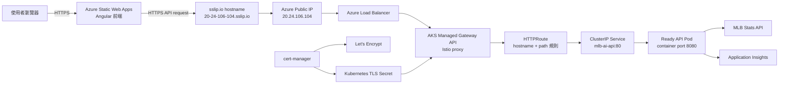
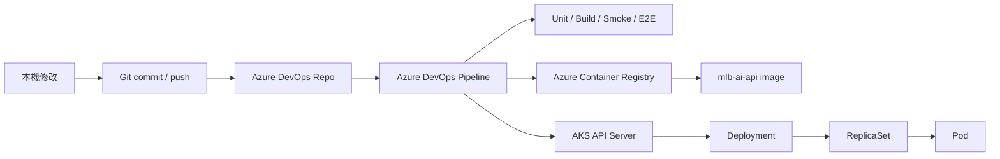

# 第一階段完整開發與部署指南

最後更新：2026-10-07

這份文件用白話整理 MLB AI Daily 第一階段的完整過程。閱讀完後，應該能回答三個問題：

1. 這個專案現在放在哪裡、怎麼運作？
2. 程式碼從 Git 經過哪些步驟，最後才跑進 AKS Pod？
3. 過程中遇到哪些問題，為什麼會發生，又怎麼修好？

## 先講結論

第一階段已完成：

```text
本機開發
  -> GitHub / Azure DevOps Repo
  -> Azure DevOps CI/CD
  -> ACR 建置 Container Image
  -> AKS Deployment 建立 Pod
  -> Kubernetes Service 提供穩定內部入口
  -> Gateway API 提供公開入口
  -> sslip.io + Let's Encrypt 提供 HTTPS
  -> Azure Static Web Apps 前端呼叫 AKS API
```

目前公開網址：

```text
Frontend: https://yellow-forest-04081e300.5.azurestaticapps.net
AKS API:  https://20-24-106-104.sslip.io
Health:   https://20-24-106-104.sslip.io/health
```

現在使用者打開前端後，資料請求確實會進入 AKS 裡的 API Pod。原本的 Container Apps backend 尚未刪除，但已不是前端 production bundle 使用的 API。

## 目前完整架構



部署流程是另一條線：



這兩張圖要分開理解：第一張是「使用者流量怎麼走」，第二張是「程式怎麼部署進去」。

## 專案目錄怎麼分

```text
backend/                         .NET API、測試、Dockerfile
frontend/                        Angular UI、Vitest、Playwright
k8s/base/                        Namespace、Deployment、Service、ConfigMap
k8s/overlays/gateway/            公開 HTTP Gateway
k8s/overlays/gateway-tls/        HTTPS、Certificate、ClusterIssuer
infra/azure/                     一般 Azure dev 資源腳本
infra/aks-lab/                   AKS 建立、部署、停止、刪除腳本
docs/                            學習筆記
azure-pipelines-backend.yml      Container Apps backend pipeline
azure-pipelines-frontend.yml     Static Web Apps frontend pipeline
azure-pipelines-aks-lab.yml      手動控制 AKS Lab 的 pipeline
```

前後端目錄分開後，Pipeline 可以用 path filter 判斷：改 backend 才跑 backend pipeline，改 frontend 才跑 frontend pipeline。

## 第一段：先讓本機應用程式可運作

一開始先完成兩個可獨立執行的程式：

- Backend：.NET API，預設本機 port `5106`。
- Frontend：Angular，固定本機 port `53180`。

本機前端呼叫 `/api` 時，Angular dev proxy 會轉送到：

```text
http://localhost:5106
```

這個 proxy 只服務本機開發。production build 不會使用本機 proxy，而是讀取：

```text
frontend/src/environments/environment.production.ts
```

目前 production API base URL 已改成 AKS HTTPS hostname。

### 這裡學到什麼

- 前端與後端可以分開啟動、分開部署。
- `localhost` 永遠代表「目前正在執行這段程式的那台電腦」，不能拿來當雲端正式 API。
- local、dev、prod 可以使用同一套程式，但提供不同設定。

## 第二段：建立 Git 與雙遠端

Repository 同時同步到：

```text
origin -> GitHub
azure  -> Azure DevOps Repos
```

GitHub 方便保存與一般 Git 協作，Azure DevOps Repo 則直接供 Pipelines 使用。現在兩邊的 `main` 都已同步到同一個 commit。

### 當時遇到的問題：GitHub 驗證

一開始 HTTPS push 需要 token，因此後來改用 SSH key `id_ed25519`。流程是：

```text
本機 private key
  -> 對 GitHub 證明身分
GitHub account 中的 public key
  -> 判斷是否允許 push
```

Private key 只能留在本機，不能貼到聊天、Git 或任何公開位置。

### 這裡學到什麼

- Git remote 只是不同的遠端地址，不代表本機要有兩份專案。
- `commit` 是本機版本紀錄；`push` 才是送到遠端。
- SSH key 與 GitHub token 都是驗證方式，但不能提交到 repository。

## 第三段：建立第一版 Azure 環境

第一版先使用比 AKS 簡單的受管理服務：

```text
Frontend -> Azure Static Web Apps
Backend  -> Azure Container Apps
Image    -> Azure Container Registry
Logs     -> Application Insights / Log Analytics
```

主要資源放在：

```text
Resource Group: rg-mlb-ai-go-dev
```

重要資源：

| 資源 | 名稱 | 用途 |
| --- | --- | --- |
| Azure Container Registry | `acrmlbaigo` | 保存 backend container images |
| Container Apps Environment | `cae-mlb-ai-go-dev` | 第一版 backend 執行環境 |
| Container App | `ca-mlb-ai-api` | 第一版公開 backend |
| Static Web App | `swa-mlb-ai-go-dev` | Angular frontend |
| Application Insights | `appi-mlb-ai-api-dev` | API request、exception 與 telemetry |
| Log Analytics | `log-mlb-ai-go-dev` | 集中查詢 Azure logs |
| Managed Identity | `id-mlb-ai-go-acr-pull` | 讓服務安全讀取 ACR image |

### 為什麼先走 Container Apps

Container Apps 幫忙處理很多底層工作，例如 ingress、HTTPS、revision 與 scale-to-zero。先用它可學會容器部署與 CI/CD，再進 AKS 拆開學習底層元件。

## 第四段：不使用本機 Docker，改用 ACR Cloud Build

原本嘗試 Docker Desktop，但啟動時出現 WSL2／socket 相關錯誤：

```text
starting services: initializing Ingest server
sailor-ingest.sock: The file cannot be accessed by the system
```

因為這台電腦主要是練習 Azure，不值得先花大量時間修 Docker Desktop，所以改成：

```text
程式碼 + Dockerfile
  -> az acr build
  -> Azure 在雲端建置 image
  -> image 直接留在 ACR
```

### 修正的好處

- 本機不需要 Docker daemon。
- 建置環境更接近 CI/CD。
- 不需要先把 image 拉回本機再推上 Azure。

### 仍然有學到 Docker 嗎

有。Dockerfile、image、tag、container 等概念都保留，只是 build engine 改在 Azure 執行。

## 第五段：建立前後端 CI/CD

### Backend Pipeline

檔案：`azure-pipelines-backend.yml`

流程：

```text
Validate
  -> dotnet restore
  -> dotnet build
  -> dotnet test
BuildImage
  -> ACR cloud build
  -> commit SHA / build ID / dev-latest tags
DeployBackend
  -> 更新 Container App image 與環境變數
SmokeTest
  -> /health、首頁、CORS
IntegrationCheck
  -> MLB data endpoint，外部 API 異常時不阻擋部署
```

`IntegrationCheck` 被設成 optional，是因為 MLB 外部 API 暫時變慢，不代表自己的 API 部署壞掉。

### Frontend Pipeline

檔案：`azure-pipelines-frontend.yml`

流程：

```text
ValidateFrontend
  -> npm ci
  -> Vitest unit tests
  -> Angular production build
  -> 發布 build artifact
DeployFrontend
  -> 部署 artifact 到 Static Web Apps
FrontendSmokeTest
  -> 確認公開網頁回應
  -> Playwright E2E
```

Frontend commit `47ce9e1` 自動觸發 run `#32`。當時 Azure CLI 清單更新較慢，以為沒有觸發，所以又手動跑了 `#33`；兩次都成功。這表示自動 CI trigger 實際正常。

### 目前兩條 Backend 部署路徑要分清楚

目前 backend source code 有兩條部署路徑：

```text
azure-pipelines-backend.yml
  -> 自動部署到 Container Apps

azure-pipelines-aks-lab.yml
  -> 手動 Build / Deploy 到 AKS
```

Production frontend 現在呼叫 AKS。因此未來修改 backend 後，只看到一般 Backend Pipeline 成功還不夠；還要手動執行 AKS Lab `Deploy`，AKS Pod 才會換成新 image。第二階段可以再把這兩條流程整合，讓通過測試的 image 以 promotion 方式部署到 AKS。

### Service Connection 是什麼

Azure DevOps 不能直接沿用瀏覽器登入狀態。Pipeline 使用：

```text
Service Connection: sc-mlb-ai-go-azure
  -> Service Principal
  -> Azure RBAC role assignment
  -> 允許 Pipeline 操作指定 Azure 資源
```

可以把它理解成「專門給自動化程式使用的 Azure 身分」。

## 第六段：加入測試、Health Check 與可觀測性

### Unit Test

Unit test 驗證小範圍程式邏輯，不需要先部署到 Azure。失敗時 Pipeline 不應繼續 build 或 deploy。

目前包含：

- Backend `.NET` unit tests。
- Frontend Vitest tests，目前 `7/7` 通過。

### Smoke Test

Smoke test 是部署後快速確認「服務至少活著而且基本設定正確」。`/health` 目前檢查：

- API process 可以回應。
- MLB Stats API client 已設定。
- CORS allowed origins 已設定。
- Application Insights connection string 已設定。
- deployment version、build ID、image tag 可辨識。

### E2E Test

Playwright 使用真正的瀏覽器打開公開網站，確認：

- Dashboard 能載入。
- 沒有 runtime page error。
- 比賽區塊可收合與展開。
- 初始資料載入完成。

### Application Insights

API 將 request、錯誤與效能 telemetry 送到 Application Insights。Log Analytics 可使用 KQL 查詢，例如 request 數量、5xx、慢請求與健康檢查。

這和單純看 Pod log 不同：Pod log 適合看單一 container 當下輸出；Application Insights 適合跨部署追蹤 request 與趨勢。

## 第七段：設定管理與 CORS

目前環境分成：

```text
local -> 本機 frontend + backend
dev   -> Azure 練習環境
prod  -> production build 使用的設定名稱；目前仍是學習環境
```

`.NET Development` 是框架的環境名稱，不等於 Azure Dev 環境。這兩個字很像，但層級不同。

### CORS 白話解釋

瀏覽器發現網頁與 API 不是同一個 origin 時，不會直接放行。API 必須明確回答：

```text
我允許這個前端網址呼叫我。
```

目前允許：

```text
https://yellow-forest-04081e300.5.azurestaticapps.net
```

最後驗證的 response header 也正確回傳這個 origin。CORS 是瀏覽器規則，不是用來取代登入驗證或網路防火牆。

## 第八段：用 IaC 描述 Azure 與 Kubernetes

IaC 是 Infrastructure as Code，意思是把環境需求寫進可版本控制的檔案，而不是只靠 Portal 手動點擊。

這個專案使用兩種宣告：

- PowerShell + Azure CLI：建立與管理 Azure 資源。
- Kubernetes YAML + Kustomize：描述 Kubernetes resources。

好處是：

- 知道環境需要哪些資源。
- 刪除後比較容易重建。
- 修改有 Git 歷史。
- Pipeline 可以重複執行相同步驟。

IaC 不代表所有資源會自動免費，也不代表每次一定百分之百重建成相同 public IP。動態值仍要重新確認。

## 第九段：規劃與建立 AKS Lab

為避免誤刪原本 dev 資源，AKS 使用獨立 Resource Group：

```text
rg-mlb-ai-go-aks-lab
```

AKS 主要設定：

```text
Cluster:       aks-mlb-ai-go-lab
Region:        East Asia
AKS tier:      Free
Node pool:     2 x Standard_D2_v4
OS disk:       32 GiB each
Network:       Azure CNI Overlay
Nodes:         2 x Ready
```

### 為什麼有兩個 Managed Identity

```text
Control plane identity
  -> AKS 管理 Azure 資源時使用

Kubelet identity
  -> Node / kubelet 拉取 ACR image 時使用
  -> 需要 ACR 的 AcrPull role
```

### AKS Pipeline 為什麼手動觸發

`azure-pipelines-aks-lab.yml` 設定 `trigger: none`，避免普通 push 就建立、停止或刪除昂貴資源。

提供操作：

| Operation | 用途 |
| --- | --- |
| `Plan` | 顯示預定設定，不修改 Azure |
| `Preflight` | 檢查登入、權限、SKU、quota、ACR 與 manifests |
| `Create` | 建立或校正 AKS |
| `Deploy` | 部署 API、Gateway 與 TLS |
| `Stop` | 停止 cluster，保留環境 |
| `Start` | 重新啟動 cluster |
| `Status` | 查詢狀態 |
| `Destroy` | 刪除 AKS 與其受管資源，需額外確認 |

## 第十段：Kubernetes Resources 怎麼合作

目前 namespace 是：

```text
mlb-ai-go
```

資源關係：

```text
Deployment
  -> 建立 ReplicaSet
      -> 維持指定數量的 Pod

Service
  -> 用 label 找 Ready Pod
  -> 提供穩定 ClusterIP 與 DNS

ConfigMap
  -> 放非敏感設定

Secret
  -> 放 Application Insights connection string

Gateway + HTTPRoute
  -> 將外部流量送到 Service
```

### Image、Container、Pod 不一樣

- Image：唯讀的應用程式包，放在 ACR。
- Container：image 啟動後的執行實例。
- Pod：Kubernetes 管理 container 的最小排程單位。

### Deployment、ReplicaSet、Pod 不一樣

- Deployment：描述版本、replicas、資源、probes 等期望狀態。
- ReplicaSet：確保實際 Pod 數量等於期望數量。
- Pod：真正執行 API；名稱與 IP 都可能改變。

前端不應直接連 Pod IP，因為 Pod 可被替換。前端連 Gateway，Gateway 經 Service 找到目前 Ready 的 Pod。

## 第十一段：Kubernetes Runtime 實驗

### Scale

將 replicas 從 1 改成 2，看到兩個 Pod，EndpointSlice 也出現兩個 Pod IP。再縮回 1，Kubernetes 自動終止多餘 Pod。

### Rolling Update

修改 Pod template 的環境變數後，Deployment 建立新 ReplicaSet，逐步換掉舊 Pod。期間舊 Pod 仍提供服務，直到新 Pod Ready。

### Rollback

使用 `kubectl rollout undo` 回到上一個 ReplicaSet，驗證 Kubernetes 可以快速回復前一版 Pod template。

### Readiness Failure

故意把 readiness path 改成不存在的網址。新 Pod 雖然 `Running`，但不是 `Ready`，因此 Service 不會把正式流量送給它；舊 Pod 保留繼續服務。

### Self-healing

手動刪除 API Pod 後，ReplicaSet 發現實際數量少於期望數量，自動建立新 Pod。Service 保持同一個地址，只把 endpoint 換成新 Pod IP。

### 三種健康檢查的差別

| 檢查 | 誰執行 | 失敗會怎樣 |
| --- | --- | --- |
| Readiness probe | kubelet 持續執行 | Pod 暫停接收 Service 流量 |
| Liveness probe | kubelet 持續執行 | Container 被重新啟動 |
| Smoke test | Pipeline 部署後執行 | Pipeline 判定部署失敗 |

## 第十二段：建立 Gateway 公開入口

Service 使用 `ClusterIP`，只能在 cluster 內存取。要讓網際網路進來，需要 Gateway。

```text
GatewayClass
  -> 指定由 AKS managed Istio 實作
Gateway
  -> 定義 HTTP/HTTPS listener
HTTPRoute
  -> 指定 hostname、path 與後端 Service
```

流量路徑：

```text
Internet
  -> Public IP
  -> Azure Load Balancer
  -> Managed Gateway proxy
  -> HTTPRoute
  -> ClusterIP Service
  -> Ready Pod
```

這是 AKS 裡的 ingress 概念。Ingress 是「外部流量如何進入 cluster」的總稱；這次採用較新的 Gateway API，而不是傳統 NGINX Ingress resource。

## 第十三段：加入免費 HTTPS

HTTPS 前端不能安全呼叫 HTTP API，瀏覽器會視為 mixed content 並阻擋。因此必須先讓 AKS API 支援 HTTPS。

免費 Lab 方案：

```text
sslip.io
  -> 將 20-24-106-104.sslip.io 解析到 20.24.106.104

cert-manager
  -> 向 Let's Encrypt 申請與續期憑證

Kubernetes TLS Secret
  -> 保存憑證

Gateway port 443
  -> 終止 TLS，再把 request 送到 Service
```

Pipeline run `#31` 成功驗證：

```text
ClusterIssuer Ready=True
Certificate Ready=True
CertificateRequest Approved=True / Ready=True
ACME Order valid
Gateway Programmed=True
HTTPS /health HTTP 200
```

sslip.io、Let’s Encrypt 與 cert-manager 本身不另外收費，但 AKS Node、disk、Load Balancer 與 Public IP 的 Azure 費用仍存在。

## 第十四段：把前端切換到 AKS

確認 HTTPS 成功後，才修改：

```text
frontend/src/environments/environment.production.ts
```

API base URL 從 Container Apps 改為：

```text
https://20-24-106-104.sslip.io
```

最後驗證：

```text
Static Web Apps:                   HTTP 200
Production bundle uses AKS URL:   true
Production bundle uses old URL:   false
AKS /api/games/today:             HTTP 200
Access-Control-Allow-Origin:       Static Web Apps URL
Playwright E2E:                    passed
```

這組證據比「網頁看起來打得開」更完整，因為它同時證明前端 bundle、HTTPS、CORS、API route 與資料回應都正確。

## 遇到的主要困難與修正

### 1. Docker Desktop 無法啟動

**現象**：WSL2／socket 初始化錯誤。

**原因**：本機 Docker Desktop runtime 問題，與專案程式碼無關。

**修正**：改用 ACR cloud build。

**學到**：Dockerfile 與 image build 不一定要在開發者電腦執行。

### 2. 登入了錯的 Azure 帳號或訂閱

**現象**：CLI 顯示公司帳號或不正確 subscription。

**原因**：瀏覽器登入、Azure CLI 登入與 Azure DevOps Service Connection 是三個不同登入狀態。

**修正**：重新以 `bbshare7788@gmail.com` 登入，並確認 `Azure subscription 1`。

**學到**：執行任何 Azure 建立動作前，先確認 account、tenant 與 subscription。

### 3. 個人帳號看得到，Pipeline 卻顯示 AuthorizationFailed

**現象**：Portal 可以看到 Lab RG，Pipeline 無法執行 `az group show`。

**原因**：Pipeline 使用 Service Principal，不是個人帳號；它原本只對 dev RG 有權限。

**修正**：讓 Service Principal 在 `rg-mlb-ai-go-aks-lab` 擁有 `Contributor`。

**學到**：本機成功不代表 Pipeline 身分也有相同 RBAC。

### 4. 預先建立 AKS Node Resource Group 造成衝突

**現象**：AKS 無法使用已存在的 `MC_*` Resource Group。

**原因**：這個 Resource Group 必須由 AKS Resource Provider 管理生命週期。

**修正**：只保留 bootstrap RG，讓 AKS 自動建立與刪除 `MC_*` node RG。

**學到**：Resource Group 有時不只是資料夾，也是服務管理邊界。

### 5. `Standard_B2s` 在 East Asia 被拒絕

**現象**：Azure 說 VM size 不允許。

**原因**：一般 VM catalog 查得到，不代表該 subscription、region 與 AKS 組合允許；quota 也可能不足。

**修正**：改用 `Standard_D2_v4`，並在 Preflight 同時檢查 regional 與 VM-family vCPU quota。

**學到**：SKU availability 與 quota 是不同檢查，都必須通過。

### 6. Gateway 啟用後第二個 istiod Pod 一直 Pending

**現象**：Event 顯示 `Insufficient cpu`。

**原因**：Scheduler 依照 resource requests 排程，不是看 `kubectl top` 的即時 CPU 使用率。單一 Node 無法承諾所有 system workloads 的 requests。

**修正**：Node pool 從 1 台擴成 2 台 `Standard_D2_v4`。

**學到**：Requests 是排程保證，實際使用率低仍可能排不下新 Pod。

### 7. Rolling Update 一直 timeout

**現象**：新 Pod 是 `Running`，但 rollout 無法完成，舊 Pod 不終止。

**原因**：readiness path 被刻意改成不存在的 `/health-does-not-exist`，新 Pod 不會進入 Ready。

**修正**：確認這是 readiness 實驗後，還原正確 manifest／rollout。

**學到**：`Running` 不等於 `Ready`；保留舊 Pod 是 Deployment 在保護服務可用性。

### 8. Pipeline 顯示成功，但 Deployment image 被改回 `dev-latest`

**現象**：health metadata 顯示新 build，獨立查 Deployment image 卻發現是 `dev-latest`。

**原因**：Pipeline 先 `set image`，後面又 apply 包含 base 的 Gateway overlay，manifest 把 image 覆蓋回去。

**修正**：調整順序：

```text
apply overlay
  -> set immutable image tag
  -> set deployment metadata
  -> wait rollout
  -> smoke test
```

**學到**：驗證不能只看應用程式自己回報的版本，也要查 Kubernetes Deployment 實際 image。

### 9. HTTPS 前端無法直接呼叫 HTTP AKS API

**現象**：設計上會遇到瀏覽器 mixed content 阻擋。

**原因**：HTTPS 網頁不能安全載入 HTTP API。

**修正**：先部署 cert-manager + Let’s Encrypt HTTPS，再切換 frontend URL。

**學到**：部署順序很重要；先準備後端 HTTPS，再改前端，可避免公開網站中斷。

### 10. 以為 Frontend CI 沒有自動觸發

**現象**：push 後最初查不到新 run，因此又手動執行一次。

**原因**：Azure DevOps CLI 清單有短暫延遲。

**修正**：稍後確認 automatic run `#32` 與 manual run `#33` 都成功，Pipeline definition 的 CI trigger 正常。

**學到**：控制平面查詢可能不是立即一致；重複操作前先看 run reason、commit SHA 與 timeline。

## 日常操作怎麼做

### 查看狀態

```bash
az aks show \
  --resource-group rg-mlb-ai-go-aks-lab \
  --name aks-mlb-ai-go-lab

kubectl get nodes
kubectl get all -n mlb-ai-go
kubectl get gateway,httproute -n mlb-ai-go
kubectl get certificate -n mlb-ai-go
```

### 看 Pod 問題

```bash
kubectl describe pod <pod-name> -n mlb-ai-go
kubectl logs deployment/mlb-ai-api -n mlb-ai-go
kubectl get events -n mlb-ai-go --sort-by=.lastTimestamp
```

### 看 rollout

```bash
kubectl rollout status deployment/mlb-ai-api -n mlb-ai-go
kubectl rollout history deployment/mlb-ai-api -n mlb-ai-go
```

### AKS Pipeline 部署參數

```text
operation:      Deploy
buildImage:     視是否需要新 image
includeGateway: true
includeTls:     true
```

### 暫停與刪除

- `Stop`：保留 cluster 設定，之後可較快 Start；部分非 compute 資源仍可能計費。
- `Destroy`：刪除 AKS 與 `MC_*` node RG，最省長期費用，但下次要重新 Create 與 Deploy。

前端現在依賴 AKS。Stop 或 Destroy 後，Static Web Apps 頁面仍可打開，但 API 資料會載入失敗。

## 目前費用邊界

免費或接近免費的部分：

- AKS control plane 使用 Free tier。
- Static Web Apps 使用 Free tier。
- sslip.io、Let’s Encrypt、cert-manager 不另外收費。
- GitHub／Azure DevOps 在目前小型練習額度內使用。

主要可能計費：

- 2 台 `Standard_D2_v4` Node VM。
- 兩個 managed OS disks。
- Standard Load Balancer 與 Public IP／資料流量。
- ACR Basic。
- Application Insights／Log Analytics 超過免費或設定額度的 ingestion。

因此不用時停止或刪除 AKS，是目前最重要的成本控制動作。

## 第一階段完成證據

```text
AKS create:             run #27 succeeded
Gateway deploy:         run #30 succeeded
Free HTTPS deploy:      run #31 succeeded
Frontend automatic CI: run #32 succeeded
Frontend manual check: run #33 succeeded
Frontend unit tests:    7/7 passed
Public frontend:        HTTP 200
Public AKS health:      HTTP 200
MLB games API:          HTTP 200
Certificate:            Ready=True
Gateway:                Programmed=True
CORS:                   allowed frontend origin verified
GitHub / Azure remote:  commit 003005e synchronized
```

## 第一階段暫時不做的項目

這些不是缺陷，而是第二階段主題：

- API workload HPA 自動擴縮。
- Container Insights／Managed Prometheus／Grafana。
- Gateway access logs。
- Azure Key Vault + Workload Identity。
- NetworkPolicy。
- 自有正式網域。
- Production 等級 Entra ID 與 Kubernetes RBAC。
- 移除或關閉舊 Container Apps backend。

## 複習時先問自己

1. 使用者 request 為什麼不直接打 Pod IP？
2. Deployment、ReplicaSet、Pod 各自負責什麼？
3. Service 如何找到新建立的 Pod？
4. Gateway 與 HTTPRoute 的差別是什麼？
5. Readiness、liveness、smoke test、unit test、E2E 各驗證哪一層？
6. ACR 裡的是 image，AKS 裡執行的是什麼？
7. 為什麼個人 Azure 帳號有權限，不代表 Pipeline 有權限？
8. 為什麼 frontend 切換前一定要先完成 AKS HTTPS？
9. 為什麼 Stop AKS 後前端頁面還在，但資料會失敗？
10. IaC 為什麼能協助重建，但仍要處理 public IP 等動態值？

## 延伸筆記索引

- `azure-current-state.md`：Azure 資源現況。
- `azure-devops-cicd.md`：前後端 Pipeline 細節。
- `aks-lab-runbook.md`：AKS 建立、RBAC、成本與操作。
- `kubernetes-runtime-lab.md`：Kubernetes resources 與 runtime 實驗。
- `gateway-api-lab.md`：Gateway API 與容量問題。
- `aks-https-tls.md`：sslip.io、Let’s Encrypt 與 cert-manager。
- `configuration-management.md`：local/dev/prod 與 CORS。
- `observability.md`：Application Insights、Log Analytics 與 KQL。
